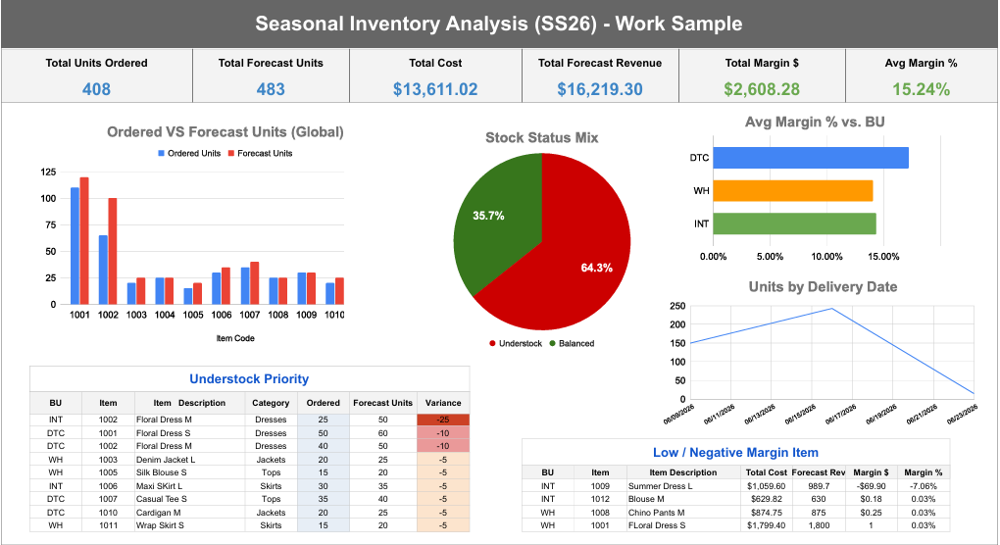

# Seasonal Buys Inventory Analysis (SS26) — Excel Case Study

Excel-based inventory planning case study analyzing seasonal buys against sales forecast and Open-to-Buy (OTB) budgets to identify underbuy/overbuy risk and margin impact.

## Executive Summary (from Inventory_Report)
- Total Units Ordered: 408  
- Total Forecast Units: 483  
- Total Margin $: 2,608.28  
- Avg Margin %: 15.24%

## What’s Inside
This workbook includes:
- Seasonal_Buys_MESSY_data → Seasonal_Buys_CLEAN_data (data cleanup + calculated fields)
- Sales_Forecast (forecast units, revenue, margin assumptions)
- OTB_Budget (OTB limits, current spend, remaining OTB)
- Inventory_Report (dashboard summary)

## Key Outputs
- PDF Dashboard: `Inventory_Report_SS26.pdf`
- Full Excel Workbook: `Seasonal_Buys_SS26_CaseStudy.xlsx`

## Skills Demonstrated (Excel)
- Data cleaning & normalization
- Calculated fields (cost, revenue, margin, variance)
- Inventory risk flagging (understock / balanced / overstock)
- Open-to-Buy tracking and budget alignment
- Executive reporting (dashboard-style summary)

## Dashboard Preview

